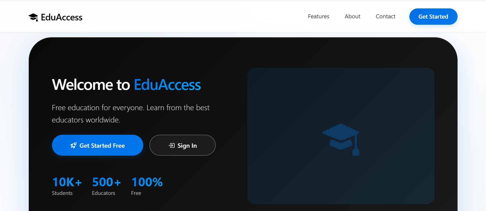
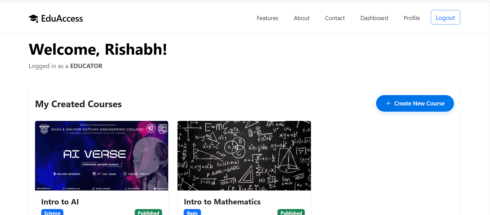
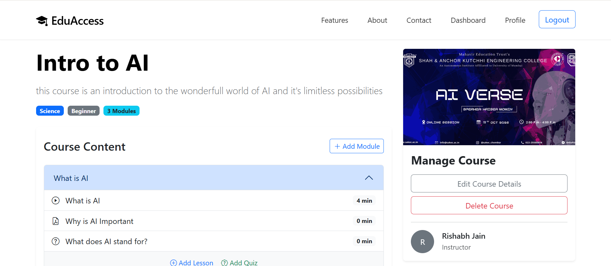
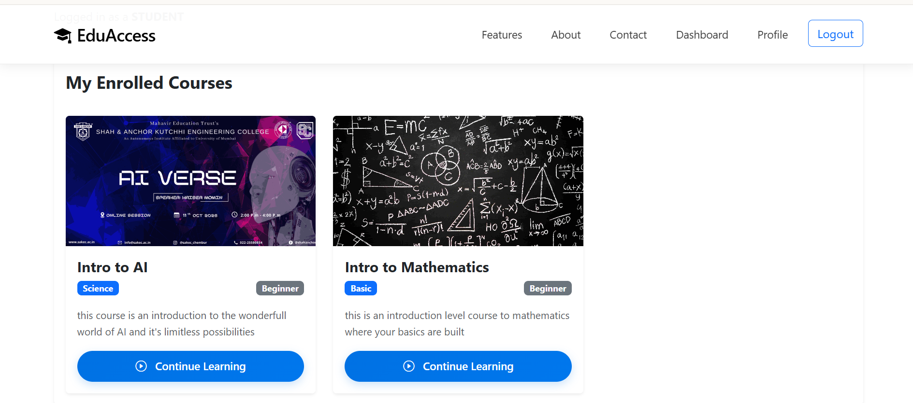

# 🎓 EduAccess - Education for Everyone

EduAccess is a modern, full-featured **Learning Management System (LMS)** designed to provide a premium and professional learning experience. Built with a focus on accessibility and sophisticated design, it bridges the gap between students and educators through a clean, intuitive, and highly functional platform.


---

## ✨ Features

### 👤 User Roles

- **Students**: Personalized dashboards, course progress tracking, interactive lesson viewing, and auto-graded assessments.
- **Educators**: Comprehensive course creator hub, module management, lesson content uploads, and student performance statistics.

---

## 📸 UI Showcase

|                              Landing Page                               |                        Educator Dashboard                         |
| :---------------------------------------------------------------------: | :---------------------------------------------------------------: |
|  |  |

|                               Course Detail                               |                           Student Learning View                           |
| :-----------------------------------------------------------------------: | :-----------------------------------------------------------------------: |
|  |  |


### 📚 Course Management

- **Curriculum Structure**: Organize content into Courses, Modules, and Lessons.
- **Rich Media Support**: Native support for **YouTube Videos**, **PDF documents**, and **Rich Text** content.
- **Image Handling**: Custom thumbnail support for a visually stunning course catalog.

### 📝 Interactive Assessments

- **Quiz Engine**: Build complex quizzes with Multiple Choice, True/False, and Short Answer questions.
- **Instant Feedback**: Auto-grading logic that provides students with immediate results and records scores.
- **Progress Tracking**: Visual progress bars and milestone tracking for student enrollments.

### 🎨 Design & UX

- **Premium Aesthetic**: Sophisticated "Capsule" layout inspired by modern design trends.
- **Glassmorphism**: Elegant blur effects and refined gradients throughout the platform.
- **Responsive**: Fully responsive design using Bootstrap 5, optimized for all devices.

---

## 🛠️ Tech Stack

- **Backend**: [Django 5.x](https://www.djangoproject.com/) (Python)
- **Frontend**: HTML5, Vanilla CSS3, Javascript (ES6+)
- **UI Framework**: [Bootstrap 5](https://getbootstrap.com/)
- **Icons**: [Bootstrap Icons](https://icons.getbootstrap.com/)
- **Database**: SQLite (Development) / PostgreSQL (Production ready)
- **Authentication**: Custom Django User Model (Email-based)

---

## 🚀 Getting Started

### Prerequisites

- Python 3.10+
- pip (Python package manager)

### Installation

1. **Clone the repository**:

   ```bash
   git clone https://github.com/yourusername/eduaccess.git
   cd eduaccess
   ```

2. **Install dependencies**:

   ```bash
   pip install -r requirements.txt
   ```

3. **Run Migrations**:

   ```bash
   python manage.py makemigrations
   python manage.py migrate
   ```

4. **Create a Superuser**:

   ```bash
   python manage.py createsuperuser
   ```

5. **Run the Development Server**:
   ```bash
   python manage.py runserver
   ```

Load the application at `http://127.0.0.1:8000/`.

---

## 📂 Project Structure

```bash
eduaccess_project/
├── accounts/           # User management, profiles, and auth
├── core/               # Course, Module, Lesson, and Quiz logic
├── main/               # Landing page and global views
├── eduaccess/          # Project configuration and settings
├── static/             # CSS, JS, and Images
├── templates/          # HTML Templates (Base, Dashboard, etc.)
├── media/              # User uploads (PDFs, Thumbnails)
└── manage.py           # Django management script
```

---

## 📄 License

This project is licensed under the MIT License - see the [LICENSE](LICENSE) file for details.

---

<p align="center">Made with ❤️ for the future of education.</p>
